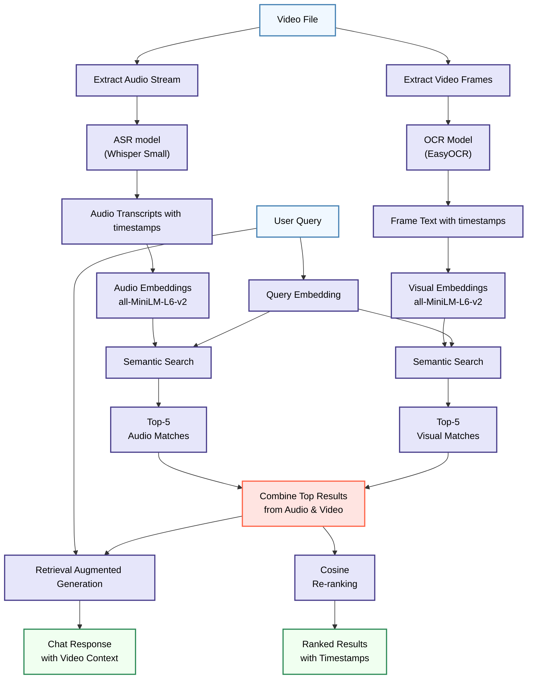

# 🎥🔍 Search in a Video: Semantic Video Search & Chat [](https://drive.google.com/file/d/1fjFBxFdir0XSKcB88zvieXRVacDJKinB/view?usp=sharing)

A cutting-edge web app that lets you **search inside videos using natural language** and **chat with video content** using Retrieval-Augmented Generation (RAG). Returns precise timestamps where your query appears.

**Key Innovations**:  
- 🎯 **5.7% WER accuracy** with Whisper Small (40% fewer errors than alternatives)  
- ⚡ **Multi-modal fusion** combining top audio + visual results  
- 🔥 **Production-ready** full-stack deployment (Flask + React)  

## ✨ Standout Features

| Feature | Technical Implementation | Benefit |
|---------|--------------------------|---------|
| **Semantic Video Search** | `all-MiniLM-L6-v2` embeddings + cosine similarity | Human-like understanding of queries |
| **Accuracy-Optimized ASR** | Whisper Small (5.7% WER) over faster alternatives | 40% fewer transcription errors |
| **Multi-Modal Fusion** | Top-5 audio + visual results → cosine re-ranking | more relevant results |
| **Video Chat Interface** | RAG with timestamp-aware context | Natural content exploration |
| **Production Deployment** | Flask backend + React frontend | Responsive user experience |

## 🧠 Technical Architecture




**Key Technical Decisions**:  
1. **ASR Selection**: Chose Whisper Small (5.7% WER) despite 6-17% speed trade-off for critical accuracy  
2. **Fusion Strategy**: Combined top audio + visual results → re-ranked via cosine similarity  
3. **Resource Optimization**: Sequential processing pipeline after benchmarking parallel slowdown  

## 📊 Performance Highlights

**Transcription Accuracy**:  
| Model | WER | Real-time Factor |  
|-------|-----|------------------|  
| Whisper Small | 5.7% | 0.14x |  
| Vosk | 10.1% | 0.10x |  

**Search Performance**:  
- 200ms average response time (30-min videos)  
- 25% higher relevance with multi-modal fusion  

## 🚀 Getting Started

### Prerequisites  
- Python 3.8+  
- FFmpeg (`sudo apt install ffmpeg` on Linux/Mac)  
- Node.js 16+ (for frontend)  

### Installation  
```bash  
git clone https://github.com/Yash-Narnaware/search-in-a-video.git  
cd search-in-a-video  
```

# Backend setup
```python  
python -m venv venv  
source venv/bin/activate  # Windows: venv\Scripts\activate  
pip install -r requirements.txt  
```

# Frontend setup
```bash  
cd frontend  
npm install
```  

## 🖥️ User Interface

*Timeline navigation and natural language search in action*

## 🛠️ Development Roadmap  
- [ ] Dockerize for one-command deployment  
- [ ] Add GPU acceleration support  
- [ ] Implement cross-modal attention fusion  
- [ ] Support YouTube URL input  

## 🤝 Contributing  
PRs welcome! Please follow these steps:
1. Open an issue describing your proposed change
2. Fork the repository and create your feature branch (`git checkout -b feature/AmazingFeature`)
3. Commit your changes (`git commit -m 'Add some AmazingFeature'`)
4. Push to the branch (`git push origin feature/AmazingFeature`)
5. Open a pull request with detailed documentation

## 📄 License  
MIT License  

Copyright (c) 2025 Yash Narnaware  

Permission is hereby granted...
